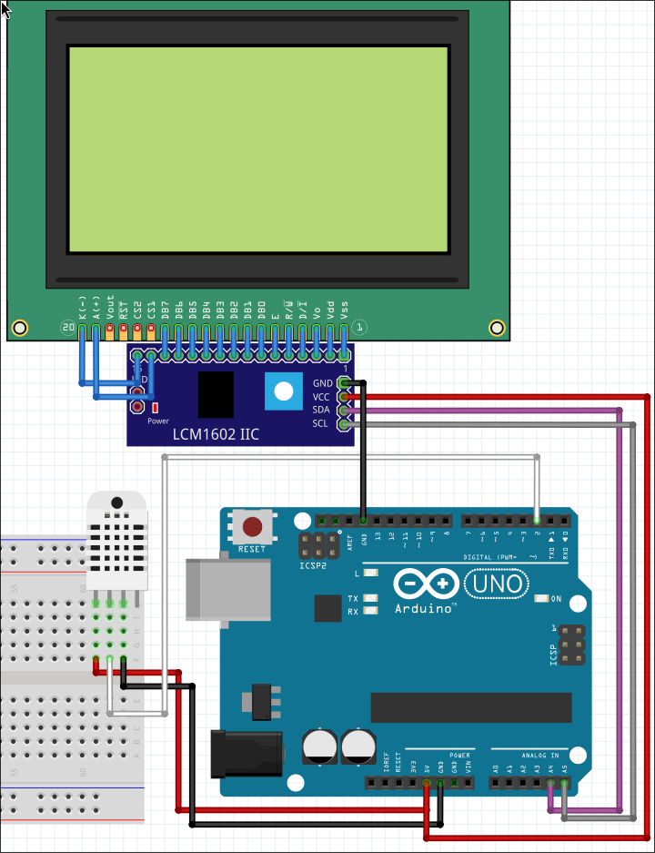

# Arduino Weather Station

**Компактная метеостанция на Arduino с DHT11 и LCD-дисплеем (I2C)**  
Устройство для измерения температуры и влажности с наглядным выводом на экран и в Serial Monitor.

---

## 🚀 Преимущества и возможности

- **Измерение температуры и влажности**  
  Используется датчик DHT11 для точного получения данных.

- **Двухканальный вывод информации**  
  Показания отображаются как на LCD-дисплее, так и в Serial Monitor.

- **I2C интерфейс**  
  Минимум проводов для подключения дисплея, удобная настройка адреса.

- **Регулируемая подсветка**  
  Возможность управления яркостью LCD-дисплея.

- **Обновление каждые 2 секунды**  
  Оптимальный баланс между частотой обновления и стабильностью работы.

- **Простая масштабируемость**  
  Легко добавить вывод в интернет, SD-карту или интеграцию с умным домом.

---

## 🖥️ Как пользоваться

1. **Подключите компоненты**  
   Следуйте схеме подключения (см. внизу README).

2. **Установите библиотеки**  
   В Arduino IDE установите:
   - `DHT`
   - `Adafruit_Sensor`
   - `Wire`
   - `LiquidCrystal_PCF8574`

3. **Загрузите скетч**  
   Откройте `.ino` файл и загрузите его в Arduino.

4. **Откройте Serial Monitor**  
   Убедитесь, что скорость 9600 бод.

5. **Наслаждайтесь результатом**  
   Данные будут отображаться на экране и в Serial Monitor.

---

## 📦 Структура проекта
```
arduino-weather-station/
├── weather_station.ino
├── README.md
└── scheme.png
```

---

## 💡 Технологии и компоненты

- **Arduino UNO/Nano** — контроллер
- **DHT11** — датчик температуры и влажности
- **LCD 1602 с I2C адаптером** — дисплей
- **Библиотеки**:
  - DHT sensor library
  - Adafruit Unified Sensor
  - LiquidCrystal_PCF8574

---

## 📝 Как запустить

1. Подключите Arduino к ПК.
2. Загрузите скетч.
3. Откройте Serial Monitor.
4. Наблюдайте обновляемые каждые 2 секунды показания.

---

## 📷 Схема подключения


